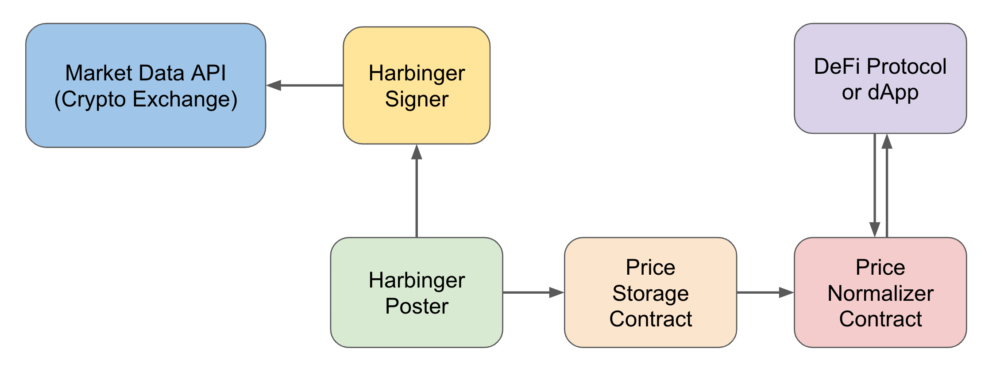
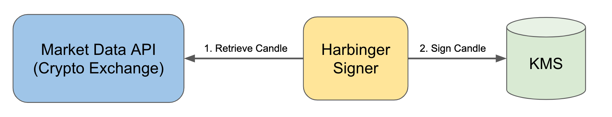
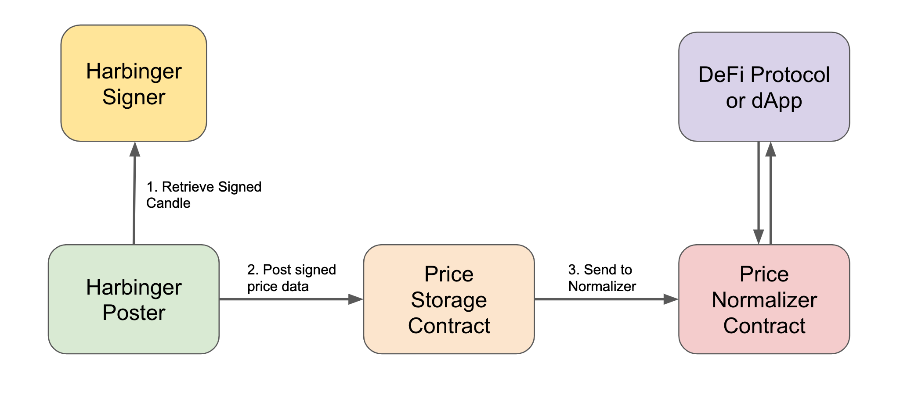

# Harbinger

## Contracts

If you are just interested in using Harbinger as a client, the current contract addresses are:

```
* Mainnet
  * Coinbase
    * Storage: [KT19B8uSfiQ8Cxk99ELc7MPccQ9ihyy7jhDU](https://tzkt.io/KT19B8uSfiQ8Cxk99ELc7MPccQ9ihyy7jhDU/storage)
    * Normalizer: [KT1KBrn1udLLrGNbQ3n1mWgMVXkr26krj6Nj](https://tzkt.io/KT1KBrn1udLLrGNbQ3n1mWgMVXkr26krj6Nj/storage)

* Ghostnet
  * Coinbase
    * Storage:[KT1UcwQtaztLSq8oufdXAtWpRTfFySCj7gFM]()https://ghostnet.tzkt.io/KT1UcwQtaztLSq8oufdXAtWpRTfFySCj7gFM)
    * Normalizer: [KT1LQU73CxMMeRtJdNGHA9JXJsTw3WDsay4B](https://ghostnet.tzkt.io/KT1LQU73CxMMeRtJdNGHA9JXJsTw3WDsay4B)
```

You can view current Harbinger data at:

* Mainnet: https://harbinger.live/
* Testnet: https://testnet.harbinger.live/

If you'd like to understand more about Harbinger works, read on!

## Introduction

Harbinger is a signed price feed for the [Tezos blockchain](https://tezos.com/) which provides a trusted price oracle for digital assets.

Harbinger's design was inspired by [Compound's Open Price Feed](https://medium.com/compound-finance/announcing-compound-open-oracle-development-cff36f06aad3). Separate entities provide signed price updates and post the signed price data on chain. This separation of responsibility leads to a decentralized solution where anyone can post signed prices on-chain, reducing dependencies on a single poster that might be offline.

Harbinger stores "candles" of prices of assets. Specifically, each data point for an asset in a Harbinger price oracle contains the following data: (1) start time, (2) end time, (3) open price, (4) high price, (5) low price, (6) close price, and (7) volume. Typically, the signed price data originates from a market order book on an exchange, where the most recent historical 1-minute candle can be retrieved and signed.



## Quickstart

The easiest way to get started with Harbinger is to install and use the [Harbinger CLI](https://github.com/tacoinfra/harbinger-cli):

```shell
$ npm i -g @tacoinfra/harbinger-cli
$ harbinger --help
```

Contracts for Harbinger are deployed at the following addresses:

* MainNet
  * Coinbase
    * Storage: [KT1Jr5t9UvGiqkvvsuUbPJHaYx24NzdUwNW9](https://tzkt.io/KT1Jr5t9UvGiqkvvsuUbPJHaYx24NzdUwNW9/storage)
    * Normalizer [KT1AdbYiPYb5hDuEuVrfxmFehtnBCXv4Np7r](https://tzkt.io/KT1AdbYiPYb5hDuEuVrfxmFehtnBCXv4Np7r/storage)
  * Binance
    * Storage: [KT1Mx5sFU4BZqnAaJRpMzqaPbd2qMCFmcqea](https://tzkt.io/KT1Mx5sFU4BZqnAaJRpMzqaPbd2qMCFmcqea/storage)
    * Normalizer: [KT1SpD9Xh3PcmBGwbZPhVmHUM8shTwYhQFBa](https://tzkt.io/KT1SpD9Xh3PcmBGwbZPhVmHUM8shTwYhQFBa/storage)
  * Gemini
    * Storage: [KT1Jud6STRGZs6hSfgZsaeztbkzfwC3JswJP](https://tzkt.io/KT1Jud6STRGZs6hSfgZsaeztbkzfwC3JswJP/storage)
    * Normalizer: [KT1JywdJbaVW5HtsYh4XNNuHcVL2vE6sYh7W](https://tzkt.io/KT1JywdJbaVW5HtsYh4XNNuHcVL2vE6sYh7W/storage)
  * OKEx
    * Storage: [KT1G3UMEkhxso5cdx2fvoJRJu5nUjBWKMrET](https://tzkt.io/KT1G3UMEkhxso5cdx2fvoJRJu5nUjBWKMrET/storage)
    * Normalizer: [KT1J623FNZ6an8NHkWFbtvm5bKXgFzhBc5Zf](https://tzkt.io/KT1J623FNZ6an8NHkWFbtvm5bKXgFzhBc5Zf/storage)
* Florencenet
  * Coinbase
    * Storage: [KT1PuT2NwwNjnxKy5XZEDZGHQNgdtLgN69i9](https://florencenet.tzkt.io/KT1PuT2NwwNjnxKy5XZEDZGHQNgdtLgN69i9/storage)
    * Normalizer: [KT1SUP27JhX24Kvr11oUdWswk7FnCW78ZyUn](https://florencenet.tzkt.io/KT1SUP27JhX24Kvr11oUdWswk7FnCW78ZyUn/storage)
* Granadanet
  * Coinbase
    * Storage: [KT1ENR6CK7cBWCtZt1G3PovwTw3FgSW472mS](https://better-call.dev/granadanet/KT1ENR6CK7cBWCtZt1G3PovwTw3FgSW472mS/operations)
    * Normalizer: [KT1MwuujtBodVQFm1Jk1KTGNc49wygqoLvpe](https://better-call.dev/granadanet/KT1MwuujtBodVQFm1Jk1KTGNc49wygqoLvpe/operations)


## Repositories

Harbinger is made up of several components in separate github repositories for discoverability. Developers, signers, posters and users may be interested in one or more of the following repositories:

- [harbinger-contracts](https://github.com/tacoinfra/harbinger-contracts): Contains reference implementations for Harbinger's smart contracts.
- [harbinger-cli](https://github.com/tacoinfra/harbinger-cli): Contains a CLI interface to deploy, update and interact with Harbinger's smart contracts.
- [harbinger-poster](https://github.com/tacoinfra/harbinger-poster): Contains a reference implementation of a posting service via AWS.
- [harbinger-signer](https://github.com/tacoinfra/harbinger-signer): Contains a reference implementation of a signing service that runs as a Serverless application on Amazon Web Services.
- [harbinger-lib](https://github.com/tacoinfra/harbinger-lib): Contains a core library shared among the above components. 

## Details

### Components

Harbinger separates creating a signed price feed from the posting of signed price data on-chain. 

At a high level, three components make up Harbinger:
- **Contracts**: A smart contract which keeps track of data on chain.
- **Signers**: A service which retrieves and signs price data. 
- **Posters**: A client which retrieves signed price data from a **signer** and posts it to the **oracle contract**, paying the required fees.

The storage contracts are initialized with the public key of a signer. As long as updates are signed correctly, they can be posted to an Oracle. 

### Signers



Any service can sign updates for the Harbinger Oracle system as long as they sign the correct data. The following services provide signed price feeds:
- [Coinbase Pro](https://pro.coinbase.com/)

### Contracts

Harbinger is made up of two contracts:
- **Price Storage Contract**: Stores the latest signed price data for each market at a specific point in time. 
- **Normalizer Contract**: Normalizes *n* data points from an specific market oracle by computing a volume weighted average price from the last *n* updates.

Data is posted to the price storage contract and can then be pushed to the normalizer contract by the same poster or another entity.



### Providers

## Technical Specifications

### Oracle Data

All price oracle data is represented in two formats:
- A standard unix timestamp for candle starts and ends
- A natural number for prices and volumes, with six digits of precision. For instance, the price `$123.45` would be represented as `123450000`.

### Asset Codes

The following asset codes are a convention in Harbinger: 

### Contract Specifications

Price storage contracts are bound to a single price feed and can contain an unlimited number of assets. All updates must be monotonically increasing in start time and must be signed by a specific key.

Specifically, the price storage contract can be configured with the following parameters:
- **Signer Public Key:** The public key of the **signer** which provides the price feed for the oracle.
- **Asset List:** A list of asset pairs (XTZ-USD, etc.) that the price storage contract will keep track of. Higher numbers of assets lead to increased gas and storage fees when interacting with the contract. For this reason, it is recommended that you deploy multiple price storage contracts in the event that you want to store more than a handful of assets.

A price storage contract has the following entrypoints:
- **`update`**: Receives a signed set of updates to the price storage contract.
- **`push`**: Pushes the data in the price storage contract to a normalizer contract.
- **`revoke`**: Revokes a price storage contract by removing the signer public key and any price data. This effectively triggers an emergency shutdown of the price oracle.

### Normalizer Contract Specifications

Normalizer contracts normalize a single asset and can only receive updates from one Oracle.  All updates must be monotonically increasing in start time.

Specifically, the normalizer contract can be configured with the following parameters:
- **Price Storage Contract Address:** The address of the price storage contract which provides updates.
- **Asset Name:** The name of the asset pair (XTZ-USD, etc.) that the contract will normalize.
- **Number of Data Points:**: The number of data points to store and normalize. Higher numbers of data points lead to increased gas and storage fees when interactin with the normalizer.

A normalizer contract has the following entrypoints:
- **`update`**: Receives data from a price storage contract.

## Credits 

Harbinger is written and maintained by [Luke Youngblood](https://github.com/lyoungblood) and [Keefer Taylor](https://github.com/keefertaylor). 
